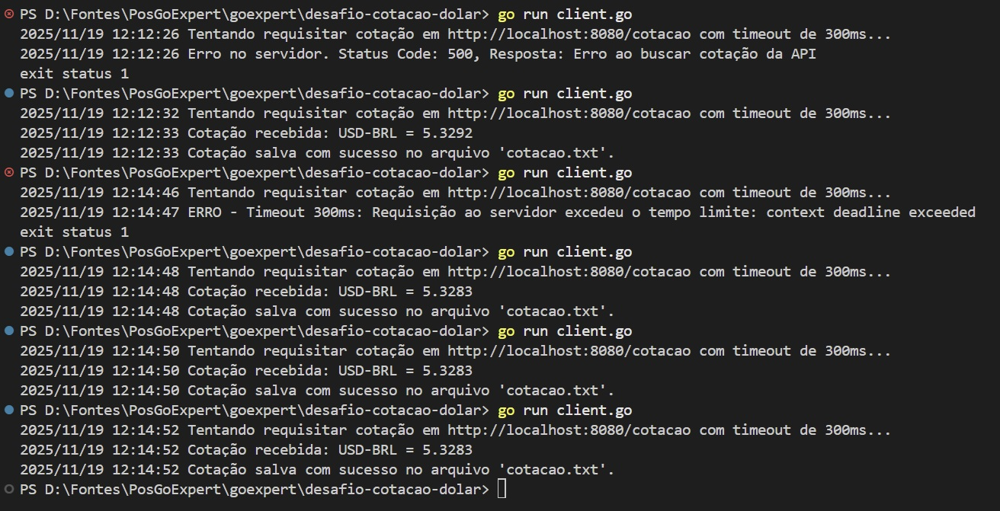
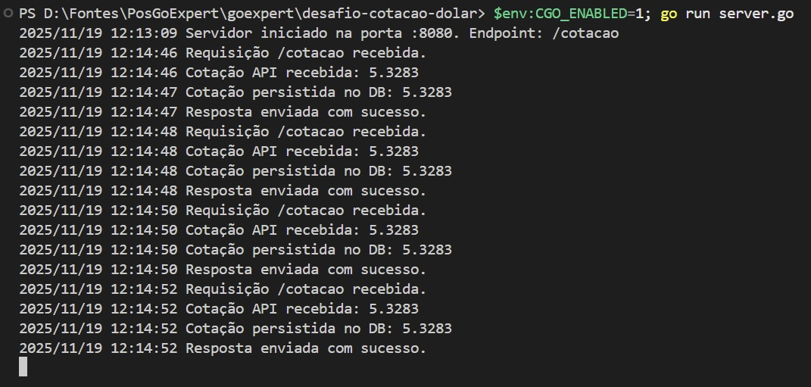

# desafio-cotacao-dolar
Este projeto criado para desafio client-server-api da Pos GoExpert. Demonstra a construção de um sistema distribuído simples em Go, composto por um servidor (server.go) e um cliente (client.go), aplicando conceitos como Contextos (Timeout), comunicação HTTP e persistência de dados em SQLite.

## Pré-requisitos
#### Inicializar módulo
`go mod init desafio-cotacao`

#### Baixar dependência 
(Se não tiver GCC instalado, siga a documentação para instalar MinGW)

`go get github.com/mattn/go-sqlite3`

### Como executar

#### App server.go
`$env:CGO_ENABLED=1; go run server.go`

##### App client.go
`go run client.go`

### Evidências

#### Client

#### Server
